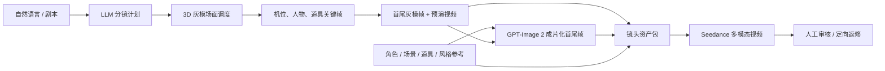

# AI 视频预演导演架构

## 产品目标

这套工作台的价值不是用低模替代成片，而是在调用昂贵、概率性的视频模型前，用低成本 3D 预演锁定五类信息：

1. 摄影机构图、焦段、运动路径和时长。
2. 人物站位、朝向、动作时序和轴线关系。
3. 道具的位置、尺度、使用方式和交互时刻。
4. 角色、场景、道具和风格的身份参考。
5. 可被图像模型和视频模型共同理解的首帧、尾帧和运动参考。

## 标准生产链路



## 镜头资产包协议

每个分镜是一个独立的 `ShotPackage`，而参考库属于项目级，跨分镜复用。

```json
{
  "id": "S01-1720000000000",
  "shotId": "S01",
  "title": "人物推门入镜",
  "duration": 5,
  "aspectRatio": "16:9",
  "visualGoal": "交代人物进入陌生空间",
  "cameraMovement": "35mm 低机位稳定跟拍",
  "previzFrames": {
    "first": { "url": "/uploads/s01-first.png", "time": 0 },
    "last": { "url": "/uploads/s01-last.png", "time": 5 }
  },
  "styledFrames": {
    "first": { "url": "/local_storage/s01-first-final.png" },
    "last": { "url": "/local_storage/s01-last-final.png" }
  },
  "previzVideo": { "url": "/uploads/s01-previz.webm" },
  "assets": [],
  "videoPrompt": "...",
  "sceneManifest": {
    "actors": [],
    "props": [],
    "cameras": [],
    "tracks": [],
    "activeCameraId": "cam1"
  }
}
```

### 多模态素材顺序

为了让提示词中的 `@1` 等引用始终稳定，打包顺序不得随意改变：

1. `@1`：成片化首帧，严格构图起点。
2. `@2`：成片化尾帧，严格构图落点。
3. `@3...`：角色、场景、道具、风格参考。
4. 最后一项：3D 预演视频，只传递运镜、站位和时序。

当模型限制素材数量时，必须保留首帧、尾帧和预演视频，优先删减低权重风格参考。

## LLM 控制分层

LLM 不应该直接写 Three.js 对象，而应该生成经过校验的预演命令。控制分为三层：

- 叙事层：场次目标、戏剧动机、情绪和镜头衔接。
- 镜头层：景别、焦段、机位高度、轴线、运镜曲线、持续时间。
- 执行层：创建资产、精确坐标、`lookAt`、姿态、关键帧和录制命令。

用户的自然语言微调应尽量作为“差量命令”执行，例如“机位低 20cm”、“尾帧留更多右侧负空间”，避免每次重建整个场景导致已确认细节漂移。

### 参数化摄影机Rig

LLM 优先输出 `set_camera_rig`，不直接拼接大量 `move_camera`。当前支持：

- `orbit`：围绕人物或产品按半径、角度和高度生成轨道。
- `dolly` / `pull_out`：沿视线方向稳定推拉。
- `truck`：横向轨道移动。
- `crane`：升降与俯拍揭示。
- `follow`：读取人物运动轨道并保持偏移跟随。
- `handheld`：受限幅度的确定性手持扰动。

所有Rig会编译为电影关键帧，默认使用 `easeInOutCubic`，位置与注视点使用样条曲线和弧长重映射，旋转使用四元数插值。

## 质量门槛

进入图像成片化前至少需要：

- 活动摄影机和明确的 `lookAt`。
- 可识别主体。
- 0 秒、中段、结束的摄影机关键帧。
- 至少一条有时序变化的轨道。
- 摄影机不与主体穿插。
- 至少一张身份或美术参考。
- 首尾灰模帧都已锁定。

进入视频生成前应再确认：

- 成片化首尾帧已通过人工审核。
- 角色数量、道具数量、服装和主色调一致。
- 3D 预演视频不超过平台支持的时长与大小。
- 提示词对每个 `@N` 素材都明确说明用途。

## 当前已落地

- 分镜级资产包和项目级参考库。
- 镜头质量检查与准备度评分。
- 参数化摄影机Rig和原子化摄影机轨道协议。
- S形缓动、Catmull-Rom路径、恒速重映射和四元数转向。
- 基于实际人物、道具和摄影机坐标的LLM场景上下文。
- 导演命令首轮质量评分与一次自动纠偏重试。
- 对资产过量、位置重叠、轨道不足、环绕越轴、焦段突变和机位过近的检查。
- 按真实画幅捕获 3D 首尾帧。
- GPT-Image 2 首尾帧成片化。
- 3D 预演视频录制、自动上传和资产包绑定。
- 一键进入 Seedance 多模态生成页并预填参数。
- 多模态本地素材在后端统一公网化。

## 下一阶段

1. 将单镜打包扩展为整条分镜队列的批量成片化与视频任务编排。
2. 在现有速度和轴线规则上增加基于WebGL射线的逐帧遮挡率与屏幕空间构图检测。
3. 导出真正的深度、法线、分割遮罩和姿态控制帧，供支持控制图的模型使用。
4. 给角色、道具和场景建立稳定 ID，在多镜头间继承身份与空间连续性。
5. 建立模型适配层，根据 Seedance、Agnes 及后续视频模型的素材数、角色、时长、分辨率与费用自动降级。
