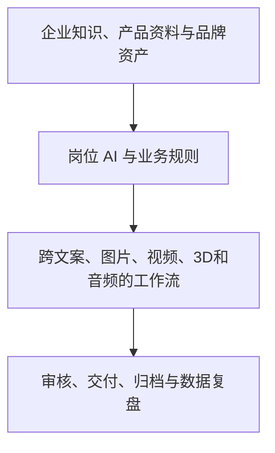

# Enbon AI 产品愿景、V1方案与 Mac 换机交接文档

> 文档日期：2026-07-15
> 当前仓库：`git@github.com:jimmyenbon-ai/ai-hubs.git`
> 当前主分支：`master`
> 适用范围：产品规划、当前实现说明、开发交接、Windows → macOS 数据迁移

## 1. 产品目标

Enbon AI 最终不是一个只面向 AI 专业用户的模型工具箱，而是一套可定制、可私有部署、普通企业员工能够直接上手的企业 AI 内容与运营工作台。

目标用户包括企业的运营、品牌、设计、视频、新媒体、市场和管理成员。他们不需要学习提示词工程、模型参数或复杂的 AI 工作流，只需要选择业务任务、提供企业材料并描述要求，系统就能在企业知识、品牌规范和权限范围内完成交付。

产品最终希望覆盖：

- 企业知识库和内部知识问答。
- 运营策划、营销活动和内容日历。
- 文案、海报、产品图与批量平面设计。
- 视频脚本、分镜、3D预演、AI视频与成片素材。
- 新媒体多平台内容和发布素材包。
- 可复用的企业岗位 AI、流程模板和行业解决方案。
- 企业级模型配置、权限、审核、审计、成本控制和私有化部署。

核心产品定位：

> 可私有部署的企业 AI 内容生产系统。系统学习企业知识和品牌规范，让普通员工通过自然语言完成从策划、设计、视频到新媒体交付的完整工作。

## 2. 关键产品判断

企业购买的不是“模型数量”，而是稳定完成业务工作的能力。因此产品壁垒应由以下四层组成：



产品界面应优先展示“我要做什么”，而不是让员工先选择模型：

- 做一套新品推广。
- 制作电商产品图。
- 生成品牌海报。
- 策划本月新媒体内容。
- 制作一条短视频。
- 设计一段3D镜头预演。
- 把部门重复工作配置成自动化流程。
- 咨询企业知识助手。

现有的图片、视频、音乐、工作流、3D等专业页面继续保留，作为高级模式和底层生产引擎。

## 3. 总体产品架构

### 3.1 企业上下文层

每家企业拥有独立上下文：

- 公司介绍、组织和部门。
- 产品、服务、FAQ、案例和销售话术。
- 品牌Logo、标准色、字体、版式、语气、关键词和禁用词。
- 客户、渠道、平台规则和历史项目。
- 知识权限、审核规则、模型策略和费用额度。

### 3.2 AI 定制四层

1. **模型层**：配置 LLM、生图、视频、音乐、语音模型，支持默认模型、备用模型、故障切换和成本策略。
2. **岗位层**：配置运营策划、平面设计、视频导演、知识助手等岗位 AI 的知识权限、工具和输出格式。
3. **工作流层**：配置企业标准流程，例如“产品资料 → 卖点 → 文案 → 海报 → 视频 → 发布素材包”。
4. **界面层**：企业可配置Logo、主题、菜单、任务入口和部门可见模块。

### 3.3 项目与交付物

后续所有内容都应归属项目，而不是散落在不同工具的历史记录中。例如“2026夏季新品发布”项目包含：

- 项目目标、负责人、状态和进度。
- 产品资料和品牌规范。
- 运营策略和文案。
- 海报、产品图和多尺寸素材。
- 视频脚本、分镜、3D预演和AI成片。
- 审核批注、版本和最终交付包。

最终交付单位应从“生成一张图”升级为“完成一个业务任务”。

## 4. AI 视频自动化与 3D 预演导演需求

### 4.1 用户原始核心思路

直接把提示词提交给 Seedance 等 AI 视频模型，构图、站位、运镜、道具和人物一致性存在较大抽卡概率。解决方案是在昂贵的视频生成之前，使用低成本、可控的3D灰模预演锁定画面和运动。

标准流程：

1. 用户使用自然语言描述镜头。
2. 内置 LLM 搭建低模场景，安排人物、道具、站位和摄影机。
3. 3D导演台生成指定时长的一镜到底或拆镜预演。
4. 导出预演首帧、尾帧和预演视频。
5. 结合人物、场景、道具和风格参考图，使用 GPT-Image 2 等图像模型把灰模首尾帧成片化。
6. 将成片化首尾帧、人物参考、道具参考和3D预演视频一起提交给 Seedance 等视频模型。
7. 视频模型主要负责渲染、动作和视觉细节，而不是重新猜测构图和运镜。

### 4.2 已实现能力

- 一镜到底和拆镜制作两种模式。
- LLM 自然语言导演命令。
- 角色、场景、道具、摄影机和资产包管理。
- 参数化摄影机 Rig：`fixed`、`orbit`、`dolly`、`pull_out`、`truck`、`crane`、`follow`、`handheld`。
- 摄影机轨道自动补全、静态伪轨道检测和录制前质量门槛。
- Catmull-Rom路径、缓入缓出、恒速重映射和旋转插值。
- 电影焦段、FOV变化、人物注视点和构图约束。
- 3D场景首尾帧捕获。
- 60fps预演视频录制。
- WebM → H.264 MP4标准转码。
- 1920×1080和电影宽银幕画幅处理。
- 转码超时、临时文件清理、分辨率校验与最大4K输入限制。
- 镜头资产包、人物/场景/道具参考和视频平台交接。
- LLM输出缺轨时的服务端与前端双重确定性补轨。
- 固定机位时允许主体运动，避免被错误改成推镜。

详细协议见：[AI_VIDEO_PREVIZ_ARCHITECTURE.md](./AI_VIDEO_PREVIZ_ARCHITECTURE.md)。

### 4.3 视频预演质量原则

- 一个15秒镜头只使用一种主运镜，最多叠加一种微弱次运动。
- 主体构图优先于运镜炫技。
- 需要录制时必须有覆盖完整时长的有效摄影机轨道。
- 纯静态空场景禁止录制；固定机位必须存在人物或道具运动。
- 摄影机位置、注视点和FOV不能同时出现突变。
- LLM只输出结构化导演命令，不直接操作 Three.js 对象。
- 用户微调应尽量生成差量命令，避免反复重建场景。

## 5. 企业工作台 V1 方案

### 5.1 兼容策略

V1 采用“旁路挂载”，没有重构或替换现有页面：

- 图片、视频、音乐、产品图、工作流、AI对话和3D导演仍使用原组件、原API和原历史数据。
- 企业工作台是独立懒加载模块。
- 企业层负责业务入口、项目、品牌、知识目录和岗位AI。
- 点击企业业务任务后，跳转到现有生产工具。
- 返回通用工作台后，原页面保持原有使用方式。

因此 V1 不会破坏当前功能，并且后续可以逐步接入后端企业能力。

### 5.2 已实现模块

1. **企业总览**
   - 企业配置完成度。
   - 进行中项目、岗位AI、知识来源和完成项目指标。
   - 最近项目和最近任务记录。

2. **业务任务入口**
   - 新品推广项目。
   - 品牌视觉物料。
   - 产品图自动化。
   - 推广视频。
   - 3D镜头预演。
   - 部门工作流。
   - 企业知识助手。

3. **项目中心**
   - 项目名称、目标、负责人、类型、状态和进度。
   - 当前活动项目。
   - 为后续跨工具资产归档预留上下文。

4. **知识与品牌**
   - 企业名称、行业、口号。
   - 品牌语气、主色、辅色、关键词和禁用词。
   - 产品、品牌、案例、规则、制度和话术的知识来源目录。

5. **岗位 AI**
   - 运营策划 AI。
   - 平面设计 AI。
   - 视频导演 AI。
   - 企业知识助手。
   - 岗位启停、可用工具和模型策略。

6. **企业配置路线**
   - 当前兼容层状态。
   - 多租户、权限、私有知识、审核、部署和审计的后续路线。

### 5.3 V1 数据方式

当前企业工作台使用浏览器版本化存储：

- Local Storage Key：`aihub_enterprise_workspace_v1`
- Schema Version：`1`
- 代码位置：`client/src/enterpriseWorkspaceStore.js`

这是为了先验证产品结构并保持现有服务稳定。它不是最终企业数据架构。

### 5.4 主要代码文件

- `client/src/EnterpriseWorkspace.jsx`：企业工作台页面和交互。
- `client/src/EnterpriseWorkspace.css`：企业工作台独立样式。
- `client/src/enterpriseWorkspaceStore.js`：版本化本地数据结构。
- `client/src/App.jsx`：企业模块懒加载、页面切换和旧工具跳转。
- `client/src/Sidebar.jsx`：企业工作台入口。
- `client/src/App.css`：企业入口公共样式。

## 6. 企业版后续路线

### 阶段 A：企业后端基座

- Organization、Department、Member、Role 数据模型。
- 企业与用户登录态。
- 多租户数据隔离。
- 企业配置 API。
- 将 V1 Local Storage 数据迁移到服务端。
- 企业工作台 JSON 导入导出。

### 阶段 B：私有知识服务

- 文档上传、解析、切片和向量检索。
- 知识来源更新和失效处理。
- 回答引用与原文定位。
- 企业、部门、岗位和项目级知识权限。
- 知识库召回质量评估。

### 阶段 C：项目与审核

- 跨工具资产自动关联项目。
- 草稿、待审核、已通过、已发布状态。
- 版本对比、批注和回退。
- 品牌规范、敏感词和合规检查。
- 最终交付包和归档。

### 阶段 D：模型与成本治理

- 企业模型网关。
- 主模型、备用模型和故障切换。
- 部门额度和单任务预算。
- 调用量、费用、成功率和耗时统计。
- 敏感数据脱敏和审计日志。

### 阶段 E：行业解决方案

- 餐饮、电商、制造、教培、房地产、文旅、展会、LED显示等行业包。
- 每个行业包包含知识结构、岗位AI、工作流、提示策略、视觉模板、审核规则和交付规范。

## 7. 当前技术结构

### 前端

- React 19
- Vite 7
- Three.js / React Three Fiber / Drei
- XYFlow
- 原生 CSS
- 默认开发端口：`3005`

### 后端

- Node.js / Express 5
- 文件型 JSON 持久化和部分 SQLite 依赖
- Multer 文件上传
- WebSocket
- ffmpeg-static 视频转码
- 默认开发端口：`3007`

### 当前模型与服务配置

- DeepSeek：LLM导演、文案和结构化命令。
- GRSai / GPT-Image 2：图像生成与首尾帧成片化。
- Seedance、Agnes：AI视频生成。
- Suno/音乐服务。
- 图床与本地素材公网化。

API密钥保存在 `server/cache/app_config.json` 或环境变量中，该文件被 `.gitignore` 排除，禁止提交到 GitHub。

## 8. Git 仓库与主要提交

远程仓库：

```text
git@github.com:jimmyenbon-ai/ai-hubs.git
```

当前3D与视频架构相关提交：

```text
2e7a86f feat: add fixed camera rig, ffmpeg timeout, and input clamping
12305f3 feat: cinematic motion, shot package, previz video controller, and UI enhancements
21918f9 feat: previz director enhancements - timeline playback, export panel, canvas, service routes
15dfeb9 feat: previz director updates - ControlPanel, ExportPanel, Canvas, Commander
```

建议后续开发不要直接长期堆积在 `master`，而是使用功能分支：

```bash
git switch -c codex/enterprise-backend-v1
```

完成功能后再合并到主分支。

## 9. macOS 开发环境搭建

### 9.1 安装基础工具

打开 Terminal：

```bash
xcode-select --install
```

安装 Homebrew（如果尚未安装），然后：

```bash
brew install git node
node --version
npm --version
git --version
```

建议使用当前 Node.js LTS。项目最低要求 Node.js 18，但在新 Mac 上建议 Node.js 20 或更高 LTS版本。

如果需要同时维护多个 Node 版本，可以使用 `nvm`：

```bash
brew install nvm
mkdir -p ~/.nvm
```

然后根据 Homebrew 输出把 nvm 初始化配置加入 `~/.zshrc`。

### 9.2 配置 GitHub SSH

```bash
ssh-keygen -t ed25519 -C "你的GitHub邮箱"
cat ~/.ssh/id_ed25519.pub | pbcopy
```

把公钥添加到 GitHub → Settings → SSH and GPG keys，然后验证：

```bash
ssh -T git@github.com
```

### 9.3 克隆项目

```bash
git clone git@github.com:jimmyenbon-ai/ai-hubs.git
cd ai-hubs
git status
git log --oneline -10
```

### 9.4 安装依赖

项目存在根目录、前端和后端三份 `package-lock.json`，建议分别安装：

```bash
npm ci

cd server
npm ci

cd ../client
npm ci

cd ..
```

如果 `better-sqlite3` 或 `sqlite3` 在 Apple Silicon 上编译失败，先确认 Xcode Command Line Tools 已安装，再执行：

```bash
cd server
npm rebuild
```

不要默认删除 `package-lock.json`，否则可能引入与 Windows 开发机不同的依赖版本。

### 9.5 启动开发环境

终端 1：

```bash
cd ai-hubs/server
npm run dev
```

终端 2：

```bash
cd ai-hubs/client
npm run dev
```

访问：

- 前端：<http://localhost:3005>
- 后端健康检查：<http://localhost:3007/api/health>

注意：旧文档中部分示例仍写 `5000` 端口，以当前代码为准，当前后端默认端口是 `3007`。

## 10. Windows → Mac 运行数据迁移

Git 只迁移代码。以下目录包含私密配置、历史数据或素材，被 `.gitignore` 排除，不会随 GitHub 自动迁移。

### 10.1 必须单独备份的内容

| Windows 路径 | 内容 | 敏感级别 | Mac 目标路径 |
|---|---|---:|---|
| `server/cache/app_config.json` | API密钥、模型地址、设置密码 | 极高 | `server/cache/app_config.json` |
| `server/cache/*.json` | 历史、工作流、角色、分镜、偏好 | 高 | `server/cache/` |
| `server/uploads/` | 上传参考图、预演视频、转码视频 | 高 | `server/uploads/` |
| `server/local_storage/` | 本地归档素材 | 高 | `server/local_storage/` |
| 浏览器 Local Storage | 企业工作台V1配置 | 中 | Mac浏览器同一Key |
| `server/.env`（如存在） | 环境变量和密钥 | 极高 | `server/.env` |

`server/logs/` 通常不需要迁移；日志较大，并可能包含接口错误上下文。

### 10.2 安全迁移原则

- 不要取消 `.gitignore` 后把上述文件推到 GitHub。
- 不要在聊天、普通网盘或未加密邮件中传输 API Key。
- 建议使用加密移动硬盘、系统加密文件或带强密码的加密压缩包。
- 在 Mac 还原后检查文件权限，确保只有当前用户可读。
- 如果不确定密钥是否泄露，换机后在对应平台重新生成密钥。

### 10.3 企业工作台 V1 浏览器数据

当前企业配置存储在浏览器 Local Storage：

```text
Key: aihub_enterprise_workspace_v1
```

迁移方式：

1. 在 Windows 浏览器打开 `http://localhost:3005`。
2. 打开开发者工具 → Application → Local Storage → `http://localhost:3005`。
3. 复制 `aihub_enterprise_workspace_v1` 对应的完整 JSON 值，保存到加密文件。
4. 在 Mac 启动同一项目并打开相同地址。
5. 在相同 Local Storage 位置创建同名 Key 并粘贴 JSON。
6. 刷新页面，检查企业名称、项目、知识目录和岗位AI是否恢复。

后续“企业后端基座”阶段应增加正式 JSON 导入导出，替代手动操作。

### 10.4 推荐迁移顺序

1. 完成并推送所有 Git 代码。
2. 在 Windows 备份 `server/cache`、`server/uploads`、`server/local_storage` 和 `.env`。
3. 导出浏览器企业工作台 JSON。
4. 在 Mac 克隆代码并先运行空数据版本。
5. 停止前后端服务。
6. 把运行数据复制到对应目录。
7. 重新启动服务。
8. 执行下方验收清单。

## 11. Mac 换机验收清单

### 代码与服务

- [ ] `git status` 干净。
- [ ] 当前分支包含企业工作台 V1 提交。
- [ ] 根目录、`server`、`client` 依赖安装完成。
- [ ] 后端 `3007` 健康检查返回成功。
- [ ] 前端 `3005` 正常打开。

### 配置与历史

- [ ] DeepSeek配置恢复，但没有提交到Git。
- [ ] GRSai/GPT-Image、Seedance、Agnes和音乐配置恢复。
- [ ] 图片生成历史可见。
- [ ] 视频和分镜历史可见。
- [ ] 工作流和角色配置可见。
- [ ] 上传的参考图和预演视频可访问。
- [ ] 企业工作台名称、项目、知识和岗位AI恢复。

### 功能验证

- [ ] AI图片生成页面正常。
- [ ] AI视频生成页面正常。
- [ ] AI视频自动化页面正常。
- [ ] 3D导演台正常显示WebGL场景。
- [ ] 摄影机轨道可以播放。
- [ ] 15秒预演可以录制。
- [ ] H.264 MP4可以预览和下载。
- [ ] 企业工作台可以进入现有图片、视频、工作流和3D工具。
- [ ] 从旧工具返回企业工作台后任务记录仍存在。

## 12. 当前已知技术债务

- 全仓 ESLint 仍有一些早期模块遗留问题；当前企业工作台和3D相关改动已单独通过 Lint。
- Vite构建提示部分3D/主应用包超过500KB，不影响功能，但后续可继续拆分。
- `README.md` 和 `QUICK_START.md` 的部分功能描述与端口已经落后于当前代码。
- 企业工作台 V1 仍是浏览器本地配置，不具备真正的多租户和服务端权限。
- 当前运行历史主要是JSON文件，需要在企业版阶段迁移到正式数据库和对象存储。
- `server/cache/app_config.json` 包含敏感密钥，换机过程中必须特别保护。
- 现有上传和日志目录可能很大，迁移前应区分“必须素材”和“可放弃日志”。

## 13. 接手开发时优先阅读

1. 本文档。
2. [AI_VIDEO_PREVIZ_ARCHITECTURE.md](./AI_VIDEO_PREVIZ_ARCHITECTURE.md)。
3. `client/src/EnterpriseWorkspace.jsx`。
4. `client/src/enterpriseWorkspaceStore.js`。
5. `client/src/DirectorPreviz.jsx`。
6. `client/src/components/previz/PrevizCommandExecutor.js`。
7. `server/services/previzDirectorService.js`。
8. `server/controllers/previzVideoController.js`。
9. `server/utils/appConfig.js`。

## 14. 下一位开发者的第一项任务

推荐从“企业后端基座”开始：

1. 建立 Organization、Department、Member 和 EnterpriseProject 数据模型。
2. 建立企业配置 API。
3. 为当前 `aihub_enterprise_workspace_v1` 增加导入、预览和迁移接口。
4. 保持企业工作台旁路挂载，不破坏现有工具。
5. 为每次迁移增加版本号和回滚方案。

验收标准：企业工作台改用服务端数据后，原有图片、视频、音乐、工作流、产品图和3D导演仍能独立使用，原历史数据无需迁移即可正常显示。
